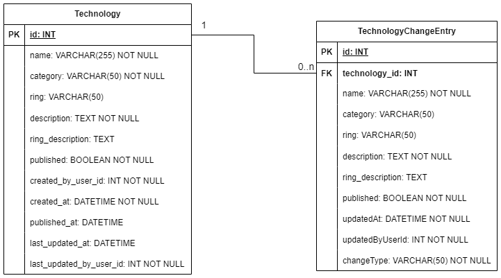
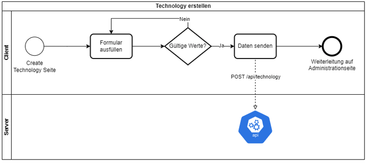
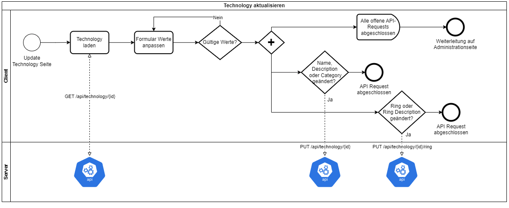
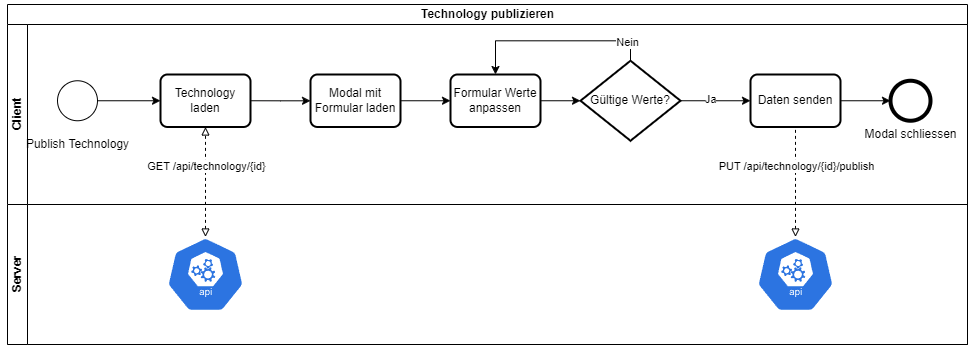

# Architekturdokumentation
Author: Patrick Henseler

## Einführung
Um den gelernten Inhalt aus dem Modul WEBLAB direkt anwenden zu können, soll eine Projektarbeit im Umfang von 60h erstellt werden.
Ich habe mich dazu entschieden, die vorgeschlagene Projektidee [Technology Radar](https://github.com/web-programming-lab/web-programming-lab-projekt?tab=readme-ov-file) umzusetzen.

Dabei konnten fast alle Anforderungen umgesetzt werden. Noch offene Aufgaben werden im Kapitel "Weiterführende Arbeiten" aufgeführt.

## Lösungsstrategie

### Entwurfsentscheidung
Die Applikation verwendet eine Single Page Application (SPA) Architektur. 

Die Applikation besteht im wesentlichen aus einem:
* Frontend für das (User Interface)
* Backend für die Datenspeicherung und Aufbereitung

Für die Kommunikation zwischen Frontend und Backend wurde eine REST-API erstellt.

### Technologieentscheidung.
Für das Frontend wird Angular mit Typescript verwendet.

Für das Backend wird NodeJS verwendet.

Als Datenbank wird eine MySQL Datenbank verwendet.

### Aufbau des Gesamtssystems


Die Versionierung des Source Code wird über github gemacht. [Frontend](https://github.com/patrick5656/TechnologieRadar-Frontend), 
[Backend](https://github.com/patrick5656/TechnologieRadar_Backend)

## Bausteinsicht

### Client-Ansichten

#### Technologie-Radar-Administration:
Technologien können in dieser Ansicht verwaltet werden. 
Dazu gehört, neue Technologien hinzufügen und bestehende zu aktualisieren. Ausserdem sollen Technologien 
publiziert werden können.

Mit einer implementierten Authentifizierung ist diese Ansicht nur für die CTO's angedacht.

#### Technologie-Radar-Viewer:
Diese Ansicht dient zum anschauen des Technologies-Stacks. Hier werden alle publizierten Technologien aufgelistet.
Die Technologien können hierbei entweder nach der Einordnung (Ring) oder nach der Kategorie gruppiert werden.

### REST-API
Das Backend stellt die folgende REST-API für das Frontend zur Verfügung.

**GET /api/technology/{id}**:
Zum Lesen einer spezifischen Technology

    {
      "id": 17,
      "name": "Angular",
      "category": "Languages & Framework",
      "ring": "Adopt",
      "description": "Angular description",
      "ring_description": "Adopt description",
      "published": 0,
      "created_by_user_id": 1,
      "created_at": "2024-02-27T23:02:45.000Z",
      "published_at": null,
      "last_updated": null,
      "last_updated_by_user_id": 1
    }

**GET /api/technologies**:
Zum Lesen aller technologien.

Optionaler Filter: (published=1) um nur publizierte Technologien anzuzeigen 

    [
      {
        "id": 17,
        "name": "Angular",
        "category": "Languages & Framework",
        "ring": "Adopt",
        "description": "Angular description",
        "ring_description": "Adopt description",
        "published": 0,
        "created_by_user_id": 1,
        "created_at": "2024-02-27T23:02:45.000Z",
        "published_at": null,
        "last_updated": null,
        "last_updated_by_user_id": 1
      },
      {
        "id": 18,
        "name": "React",
        "category": "Languages & Framework",
        "ring": "Trial",
        "description": "React description",
        "ring_description": "Trial description",
        "published": 0,
        "created_by_user_id": 1,
        "created_at": "2024-02-27T23:03:07.000Z",
        "published_at": null,
        "last_updated": null,
        "last_updated_by_user_id": 1
      }
    ]

**POST /api/technology**:
Zum speichern einer neuen Technology.

    {
      "name": "Angular",
      "category": "Languages & Framework",
      "ring": "Adopt",
      "description": "Angular description",
      "ring_description": "Adopt description"
    }


**PUT /api/technology/{id}**:
Zum updaten einer bestehenden Technology.

    {
      "name": "Updated name",
      "category": "Tools",
      "description": "Updated description"
    }

**PUT /api/technology/{id}/ring**:
Zum anpassen der Einordnung einer Technology.
  
    {
      "ring": "Assess",
      "ring_description": "Updated Ring description"
    }

**PUT /api/technology/{id}/publish**:
Zum publizieren einer Technology.

    {
      "ring": "Assess",
      "ring_description": "Updated Ring description"
    }

### Datenbank 
Der NodeJS Service benötigt eine MySQL Datenbank. Das ERD von der Datenbank sieht wie folgt aus. 
Für die Erstellung der Datenbank kann das Skript "my_sql_init.sql" verwendet werden. 


## Laufzeitsicht
Im wesentlichen gibt es drei Prozessabläufe, um Technologien zu erstellen, aktualisieren und publizieren. 
Der Ablauf dieser Prozesse wird im folgenden durch Diagramme aufgezeigt.


Technology erstellen:



Technology aktualisieren:



Technology publizieren:



## Verteilungssicht
Aktuell wird die Applikation noch nicht deployt. Es ist möglich, das Frontend und Backend getrennt zu deployen. 
In diesem Fall muss CORS erlaubt werden.

Im Frontend muss beim Deployment im TechnologyService die verwendete URL zum Server angepasst.

Für ein Deployment vom Backend wird eine MySQL Datenbank benötigt. Für die Erstellung der Datenbank muss das "my_sql_init.sql" ausgeführt werden.
Die Zugangsdaten für den Zugriff auf die Datenbank müssen in den Enviroment Variablen angepasst werden.

## Querschnittliche Konzepte
Authentifizierung:
Aktuell wird keine Authentifizierung und Autorisierung durchgeführt.


## Architekturentscheidungen
Mit Standalone Komponenten ist es möglich, komplett auf Module in einer Angular App zu verzichten.
Ich habe mich jedoch dazu entschieden, meine Angular App modular aufzubauen, da aus meiner Sicht so die 
Applikation strukturierter ist.

Die Applikation ist im wesentlichen wie folgt aufgebaut. Es wird pro Feature ein eigenes Directory erstellt. 
Komponenten und Services, welche von mehreren Features verwendet werden, sind im Directory shared abgelegt.
```
📦 app
├─ features
│  ├─ feature 1
│  │  ├─ components
│  │  └─ pages
│  └─ feature 2
└─ shared
   ├─ services
   └─ types
```

### Change History
Es wurde entschieden, dass Tracking von Technology-Anpassung über das Backend zu regeln.
Bei allen POST und PUT Endpunkten wird neben der eigentlichen Anpassungen ein entsprechend TechnologyChangeEntry Eintrag erstellt.
Dabei werden alle neue Werte gespeichert und mit der effektiven Technology verknüpft. Ein solcher Eintrag enthält auch
einen Eintrag, um welche Anpassung es sich handelt.

Dabei sind folgende Änderungen möglich:
 * created
 * update
 * change_ring
 * publish

### Technology aktualisieren
Es wurde entschieden, dass Technology anpassen (Name, Description und Category) sowie anpassen der Einordnung
(Ring und Ring Description) im gleichen Formular durchzuführen. 

Dabei wird geprüft:
 * Wurde der Name, die Category oder die Description angepasst? --> PUT /api/technology{id} request ausführen.
 * Wurde der Ring oder die Ring description angepasst? --> PUT /api/technology{id}/ring request ausführen.

Dabei können beide oder auch nur ein Request ausgeführt werden.

### Testing

#### Frontend
Im Frontend wurden zum einen Unittests erstellt. Dabei werden Services mithilfe von jasmine gemockt.

Neben den Unittests wurden mit Cypress e2e tests erstellt.

#### Backend
Im Backend wurden Unittests erstellt. Die effektiven Datenbank Abfragen wurden in eine eigene Klasse ausgelagert,
welche in den Testfällen mit der Library Sinon gemockt werden.

## Qualitätsanforderungen
Der Technologie-Radar-Viewer soll neben der Desktop-Ansicht, auch für die Mobile-Ansicht optimiert sein.

Der Technologie-Radar-Viewer soll innert 1s geladen sein.

Sämtliche Änderungen an Technologie-Einträgen sollen historisiert sein.

## Weiterführende Arbeiten
- Implementierung der Authentifizierung und Autorisierung mit den Rollen 'CTO' und 'Mitarbeiter'
- Validierung ob die Technology nicht bereits publiziert worden ist vor dem publizieren. (Im Happy-Case kann dieser Fall nicht eintreten) 
- Deployment der Applikation

