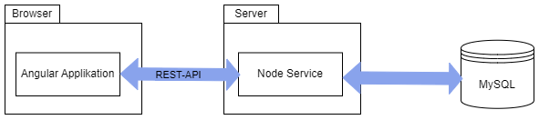

# Dokumentation zur Umsetzung des Technology-Radars

# Einführung
Um den gelernten Inhalt aus dem Modul WEBLAB direkt anwenden zu können, soll eine Projektarbeit im Umfang von 60h erstellt werden.
Ich habe mich dazu entschieden, die vorgeschlagene Projektidee [Technology Radar](https://github.com/web-programming-lab/web-programming-lab-projekt?tab=readme-ov-file) umzusetzen.

# Lösungsstrategie
Die Applikation verwendet eine Single Page Application (SPA) Architektur.

Das Frontend wurde mit Angular und TypeScript erstellt. Für das Backend wurde NodeJS und eine MySQL Datenbank verwendet.
Für die Kommunikation wurde eine REST-API definiert.

Die Versionierung des Source Code wird über github gemacht. [Frontend](https://github.com/patrick5656/TechnologieRadar-Frontend), 
[Backend](https://github.com/patrick5656/TechnologieRadar_Backend)

# Bausteinsicht
TODO: Client / Server

Ansichten des Clients

## Client-Ansichten
Technologie-Radar-Administration:
Technologien können in dieser Ansicht vom CTO oder einem Tech-Lead verwaltet werden. Dazu gehört, neue Technologien hinzufügen, bestehende aktualisieren und löschen. Ausserdem sollen Technologien publiziert werden können.

einem Technologie-Radar-Viewer:
Diese Ansicht dient den Mit
ie-Radar-Viewer, auf welcher der Technologie-Radar resp. die Technologien allen Mitarbeiter eingesehen werden können.

System-Administration (Optionale Ansicht):
In dieser Ansicht soll es möglich sein, neue Mandanten zu erfassen und zu verwalten. Es soll ausserdem möglich sein, neue Personen zu einem Mandanten hinzuzufügen.

EVTL noch wie die Komponenten strukturiert sind.

REST-API
**GET /api/technology/{id}**:
Zum Lesen einer spezifischen Technology

    {
      "id": 17,
      "name": "Angular",
      "category": "Languages & Framework",
      "ring": "Adopt",
      "description": "Angular description",
      "ring_description": "Adopt description",
      "published": 0,
      "created_by_user_id": 1,
      "created_at": "2024-02-27T23:02:45.000Z",
      "published_at": null,
      "last_updated": null,
      "last_updated_by_user_id": 1
    }

**GET /api/technologies**:
Zum Lesen aller technologien.

Optionaler Filter: (published=1) um nur publizierte Technologien anzuzeigen 

    [
      {
        "id": 17,
        "name": "Angular",
        "category": "Languages & Framework",
        "ring": "Adopt",
        "description": "Angular description",
        "ring_description": "Adopt description",
        "published": 0,
        "created_by_user_id": 1,
        "created_at": "2024-02-27T23:02:45.000Z",
        "published_at": null,
        "last_updated": null,
        "last_updated_by_user_id": 1
      },
      {
        "id": 18,
        "name": "React",
        "category": "Languages & Framework",
        "ring": "Trial",
        "description": "React description",
        "ring_description": "Trial description",
        "published": 0,
        "created_by_user_id": 1,
        "created_at": "2024-02-27T23:03:07.000Z",
        "published_at": null,
        "last_updated": null,
        "last_updated_by_user_id": 1
      }
    ]

**POST /api/technology**:
Zum speichern einer neuen Technology.

    {
      "name": "Angular",
      "category": "Languages & Framework",
      "ring": "Adopt",
      "description": "Angular description",
      "ring_description": "Adopt description"
    }

**PUT /api/technology/{id}**:
Zum updaten einer bestehenden Technology.

    {
      "name": "Updated name",
      "category": "Tools",
      "description": "Updated description"
    }

**PUT /api/technology/{id}/ring**:
Zum anpassen der Einordnung einer Technology.
  
    {
      "ring": "Assess",
      "ring_description": "Updated Ring description"
    }

**PUT /api/technology/{id}/publish**:
Zum publizieren einer Technology.

    {
      "ring": "Assess",
      "ring_description": "Updated Ring description"
    }

TODO: ERD von der Datenbank

# Laufzeitsicht
Ablauf eines Requests

# Verteilungssicht
Aktuell wurde die Applikation noch nicht deployt. Es ist möglich, das Frontend und Backend getrennt zu deployen. In diesem Fall muss CORS erlaubt werden.

Im Frontend muss beim Deployment im TechnologyService die verwendete URL zum Server angepasst.

Für ein Deployment vom Backend wird eine MySQL Datenbank benötigt. Für die Erstellung der Datenbank muss das "my_sql_init.sql" ausgeführt werden.
Die Zugangsdaten für den Zugriff auf die Datenbank müssen in den Enviroment Variablen angepasst werden.

# Querschnittliche Konzepte
Authentifizierung:
Aktuell wird keine Authentifizierung und Autorisierung durchgeführt.

# Entwurfsentscheidungen
Mit Standalone Komponenten ist es möglich, komplett auf Module in einer Angular App zu verzichten.
Ich habe mich jedoch dazu entschieden, meine Angular App modular aufzubauen für Features, da aus meiner Sicht so die Applikation strukturierter ist.

TODO: Routing

TODO: Change History wird über das Backend erledigt.

# Qualitätsanforderungen
Der Technologie-Radar-Viewer soll neben der Desktop-Ansicht, auch für die Mobile-Ansicht optimiert sein.

Der Technologie-Radar-Viewer soll innert 1s geladen sein.

Sämtliche Änderungen an Technologie-Einträgen sollen historisiert sein.

